# Projekat-Arhitektura-i-projektovanje-softvera

Projekat iz predmeta Arhitektura i projektovanje softvera je TaskIT platforma. TaskIT je višekorisnička web aplikacija koja povezuje korisnike koji mogu da postavljaju poslove koje žele da neko drugi obavi umesto njih i korisnike koji žele da da te poslove obave. Ideja je da korisnici koji obavljaju poslove vrše pretplatu na tipove poslova ili na korisnike za koje žele da obavljaju poslove.
*Tehnologije: Na backendu je korišćen AP.Net Core 8 sa Entity Frameworkom, SignalR za ostvarivanje asinhrone komunikacije. Za autorizaciju i autentifikaciju je korišćen Microsoft Identity sa JWT Tokenom. Na frontentu koristim React sa Tailwind bibliotekom za stilizovanje.
*Arhitekturni dizajn softverskog sistema uključuje upotrebu sledećih arhitekturnih obrazaca: 
    1. Layered obrazac - sistem je realizovan u troslojnoj arhitekturi kako bi se omogućila modularnost sistema i nezavisnost u razvoju određenih delova sistema. Arhitektura sistema će se sastojati od sloja perzistencije, serverskog sloja i prezentacionog klijentskog sloja. Sloj perzistencije je u osnovi, komunicira sa serverskim slojem i omogućava skladištenje podataka tj predstavlja samu bazu podataka. Prezentacioni sloj obezbeđuje interakciju korisnika sa sistemom preko korisničkog interfejsa. Povezan je sa serverskim slojem. Serverski sloj predstavlja vezu između slojeva perzistencije i prezentacionog sloja. Izvršava se na serveru i implementira poslovnu logiku sistema, funkcije za perzistenciju podataka i sinhronu i asinhronu komunikaciju sa klijentom. 
    2. Publish-subscribe - distribuirani sistem sam po sebi zahteva neki vid komunikacije. Za ostvarivanje asinhrone komunikacije ovaj obrazac je iskorišćen kroz SignalR. Korisnici primaju obaveštenja o izmenama oglasa ali i o kreiranju novih oglasa preko tipova poslova ili poslodavaca koje prate. Takođe, poslodavac će biti obavešten o praćenju, o prijavi za posao i o otkazivanju posla. 
    3. Model - View - Controller - obrazac je implementiran u sistemu kroz njegova tri dela. Model predstavlja sloj domenskih klasa koje se koriste za kreiranje tabela u bazi podataka primenom Model first pristupa. View deo će biti zadužen za izvršavanje i prikaz sadržaja na klijentu a omogućava korisniku da poziva metode iz Controller-a kojim se utiče na stanje podataka u bazi. 
    4. Repository - korišćenjem ovog obrasca logika direktnog pristupa bazi podataka i ažuriranja podataka je izdvojena iz Controller-a čime je ostvarena jednostavnost implementacije u cilju postizanja olakšanja izmena i proširljivost sistema. Odvaja logiku pristupa bazi od kontrolera.
*Projektni obrasci: 
    1. Uz SignalR koristim Observer projektni obrazac. Subject(Publisher) - NotificationService i NotificationServiceImpl emituju događaje ka klijentima. Observers - ReactApp koja poziva .on() metode. Kada metode pošalju event svi pretplaćeni klijenti dobijaju obaveštenje. SubscriptionLogic - SignalRGroupManager - kada se korisnik poveže dodajemo ga u određene grupe pozivom metode AddUserToGroupAsync(), čime se rešava ko je pretplatnik na koji event. 
    2. Mapper - iskorišćen kako bi se izdvojila logika mapiranja modela podataka na DTO, čime se model podataka i perzistencija odvajaju od podataka koje primamo i obrađujemo na frontend aplikaciji. Podaci se prevode iz DTO u model entiteta kada dolaze spolja i iz modela entiteta u DTO kada se šalju nazad. Ovo je urađeno da bi se pojednostavio prenos podataka jer često modeli imaju veze i logiku i podatke koji treba da ostanu poverljivi, a takođe se i olakšava održavanje jer su izmene lokalizovane na DTO/model. 
    3. Strategy - ponašajni projektni obrazac koji je iskorišćen za selekciju tipa filtera za vraćanje dostupnih oglasa. Algoritmi za različite kriterijume pretrage su enkapsulirani u posebne klase što omogućava da se kriterijum menja u runtime-u bez menjanja ostatka sistema. JobFilterStrategy - definiše zajednički metod koji svi algoritmi moraju imati Filter(). ConcreteStrategy - konkretne implementacije različitih algoritama. Context - metoda GetFilteredJobAdvertisements u JobAdvertisementControlleru koja koristi neku od strategija na osnovu prosleđenih parametara od klijenta preko JobFilterStrategyFactory-a.Factory služi da na osnovu ulaza odredi i generiše konkretnu strategiju koja će se koristiti. Dodavanje novog kriterijuma znači dodavanje nove implementacije u Concrete Strategy. Controller ne zna detalje o tome kako filtriranje radi, i samim tim je i njegova struktura pojednostavljena.
\*Korisnički interfejs:
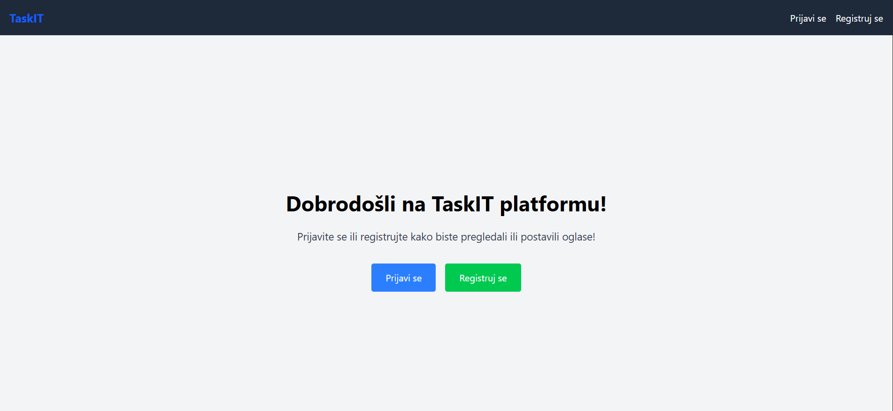
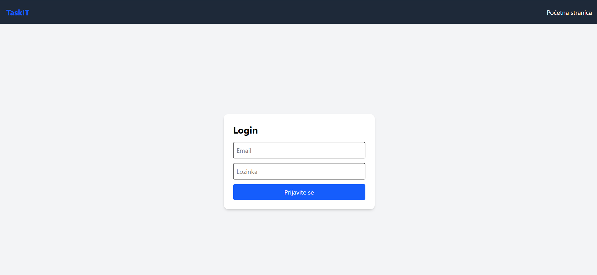
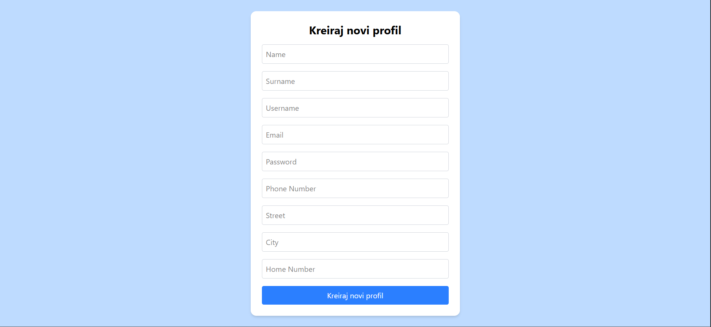

Korisnički interfejs radnika:
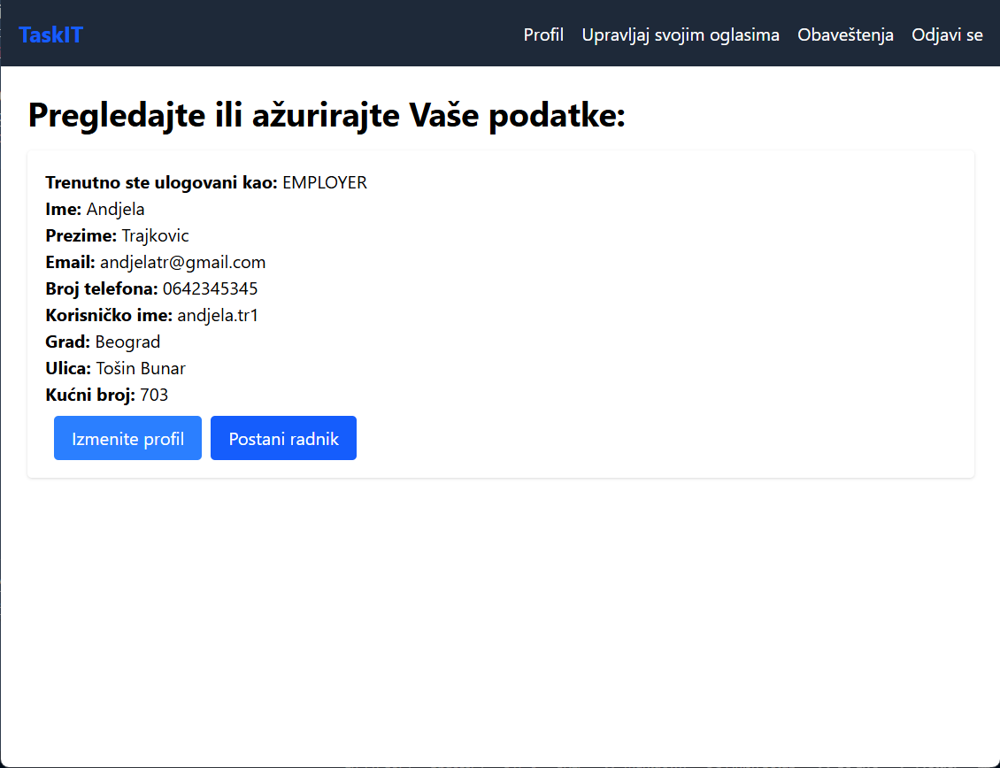
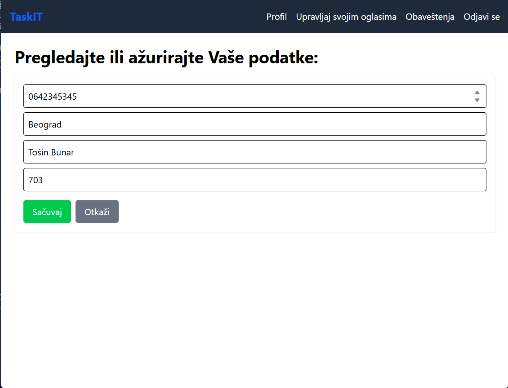
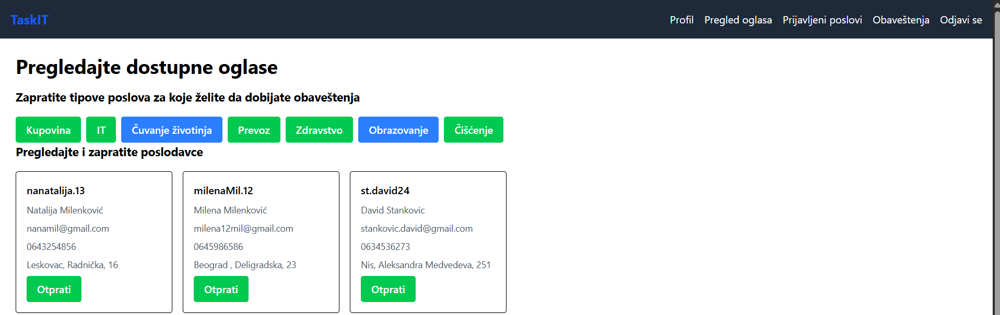

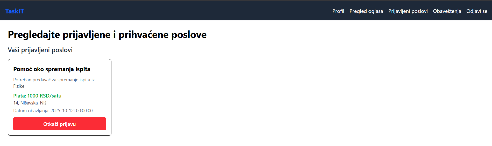
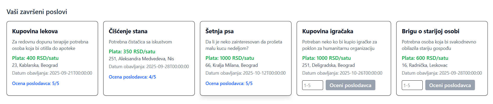
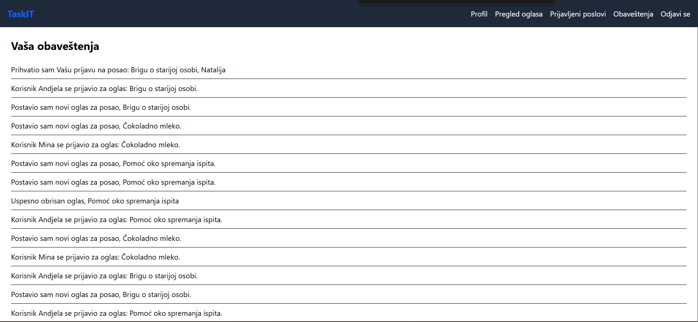

Korisnički interfejs poslodavca:
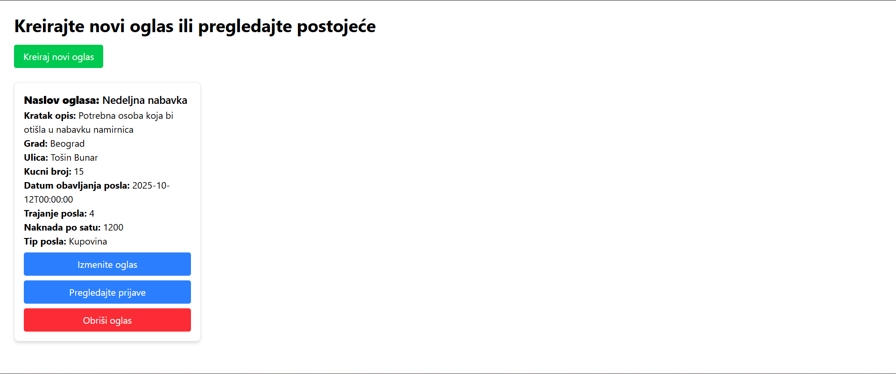
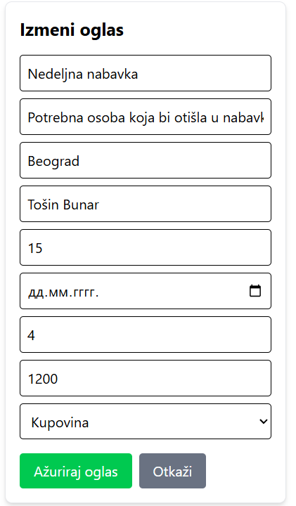
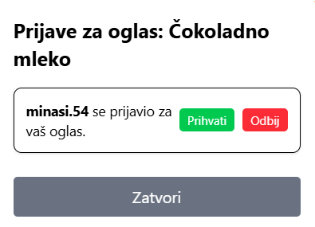
